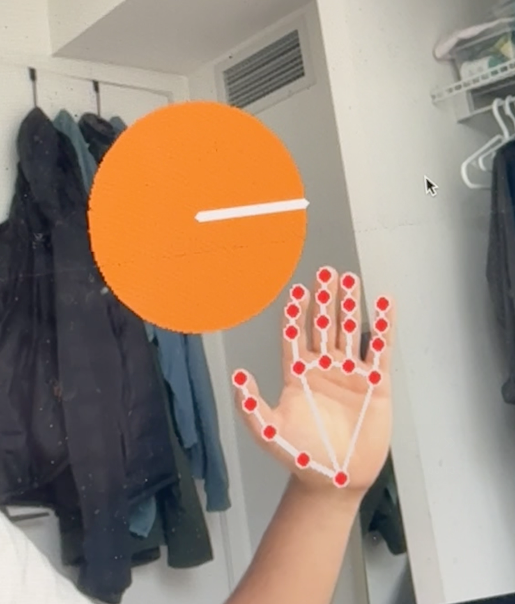

# Finger Music with OpenCV

This project is an interactive computer vision music demo that turns your hand into a virtual instrument.

Using **OpenCV** and **hand tracking**, the system detects your fingers in real time and maps each finger to a musical note. When you touch a finger to your thumb, the corresponding note plays. The project also includes an instrument-switching feature, where pressing the orange on-screen ball changes the sound set, letting you play different instruments with the same hand gestures.

This was a fun project, but it also showed me how computer vision can be used to create creative, interactive systems that go beyond simple tracking demos.

---

## Demo Video

[](./demo/IMG_1276.mov)

## What this project is

This project uses webcam-based hand tracking to let users make music with their fingers.

The system watches your hand through the camera, identifies finger positions, and assigns each finger to a note. When a finger touches the thumb, it acts like pressing a key, triggering a sound.

In addition to note playing, the project includes a simple on-screen control: an orange ball that can be pressed to switch between different instruments.

The result is a gesture-based music system that feels playful, interactive, and educational.

---

## Core features

- real-time hand and finger tracking
- thumb-to-finger touch detection for note input
- each finger mapped to a different musical note
- instrument switching through an on-screen control
- webcam-based interaction with no physical instrument required

---

## How it works

The system captures live webcam input and detects the hand using computer vision.

It then:

- tracks finger landmarks in real time
- checks when a finger touches the thumb
- maps that gesture to a note
- plays the corresponding sound
- allows the user to press the orange ball to switch instruments

This creates a virtual music-playing experience controlled entirely by hand gestures.

---

## Why I built this

I built this project because I wanted to take what I learned from earlier OpenCV hand-tracking work and turn it into something more creative and interactive.

Instead of only tracking motion, I wanted to use finger detection as real input for something meaningful. Music felt like a great fit because fingers naturally map to notes, and hand gestures already feel similar to playing an instrument.

This project also let me explore the idea that software can make certain experiences more accessible. Someone who does not own a physical instrument can still use this project to get a feel for note positions and basic musical interaction.

---

## Educational value

One of the most interesting parts of this project is that it is not just a fun demo — it can also help with music learning.

Because each finger corresponds to a note, users can experiment with how notes are played and switch between instruments without needing to physically own those instruments.

That makes the project useful for:

- beginners exploring musical notes
- people who want a playful introduction to instruments
- users experimenting with note patterns and finger movement
- anyone interested in creative computer vision projects

It is not a replacement for a real instrument, but it can be a fun and accessible way to explore how different notes and instrument sounds work.

---

## Tech stack

This project was built with:

- **Python**
- **OpenCV**
- **MediaPipe**
- **NumPy**
- **audio playback libraries** for note triggering

### Main technologies
- **OpenCV** for webcam capture and drawing the visual interface
- **MediaPipe** for hand landmark detection and tracking
- **NumPy** for gesture and coordinate calculations
- **Python audio handling** for playing instrument sounds when notes are triggered

---

## What I learned

This project taught me a lot about turning hand tracking into a real interactive system.

Some of the biggest things I learned were:

- how to use hand landmarks as input controls
- how to detect finger-to-thumb contact in real time
- how to map gestures into musical behavior
- how to build a simple interactive UI inside an OpenCV application
- how to combine computer vision with audio playback for a more complete user experience

It also helped me realize that computer vision projects become much more interesting when the tracking is tied to something the user can immediately experience, like sound.

---

## Why this project matters

This project was important because it pushed me beyond basic tracking and into building a complete interactive experience.

It took the same kinds of concepts used in hand detection and gesture logic, then turned them into something fun, usable, and memorable. Instead of just detecting a hand, the system actually lets the user do something with that detection.

That shift — from tracking to interaction — was one of the most valuable things I learned from building this.

---

## Running the project locally

### Prerequisites

Make sure Python is installed, then install the required dependencies.

Example:

```bash
pip install opencv-python mediapipe numpy